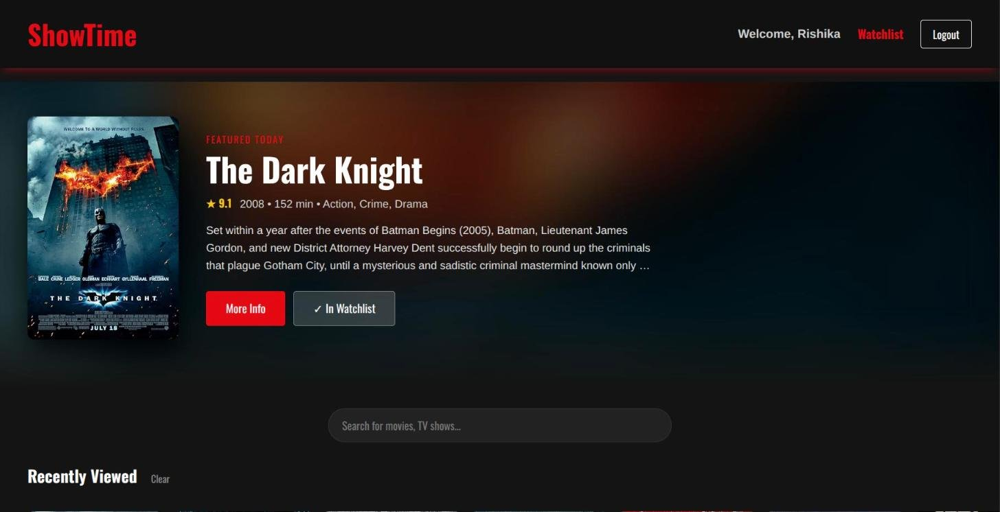
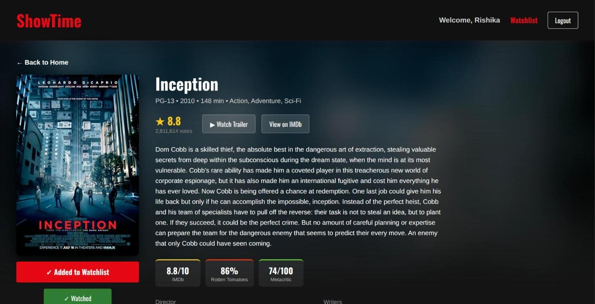
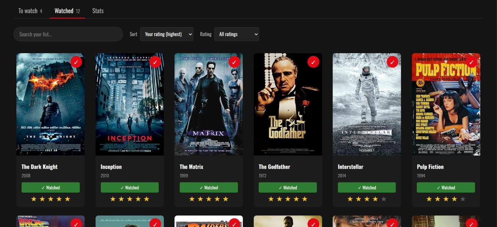
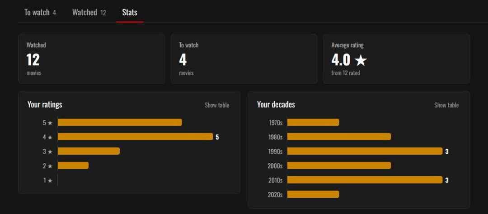
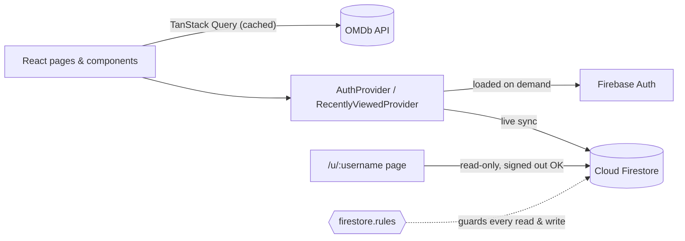

<div align="center">

# ShowTime

**A cinematic movie discovery app: browse, search, track what you watch, and share your watchlist.**

[](https://github.com/Rishikapurbey/ShowTime/actions/workflows/ci.yml)    

[**Live demo**](https://show-time-chi.vercel.app/) · [Features](#features) · [Getting started](#getting-started) · [Architecture](#architecture) · [Testing](#testing)



</div>

## About

ShowTime is a single-page React app for finding movies and keeping track of them. Movie data comes from the [OMDb API](https://www.omdbapi.com/). Accounts, watchlists and sharing run on Firebase Authentication and Cloud Firestore, protected by security rules that are tested against the Firestore emulator in CI.

The app also works without Firebase configured: browsing, search and movie pages keep working, and account features switch off with a clear message.

## Features

### Discover
- **Featured movie banner** on the homepage, rotating daily.
- **Curated rows** (latest releases, action, thrillers, comedies and more) that scroll horizontally, with arrow controls on desktop.
- **Live search** as you type, with an *All / Movies / Series* filter and *Load more* paging. The query lives in the URL, so Back and shared links keep your results.
- **Detailed movie pages** with plot, cast, IMDb / Rotten Tomatoes / Metacritic scores, and trailer and IMDb links.
- **Recently Viewed** row of the movies you opened last, synced across devices when you're signed in.

### Your watchlist
- **Email/password and Google sign-in**, with password reset and readable error messages.
- **Synced watchlist** stored in Firestore and updated live across devices. Add movies from any card or movie page.
- **Watched status and 1–5 star ratings.** Rating a movie marks it as watched.
- **To watch / Watched tabs** with sorting (date added, title, release year, your rating), a rating filter and title search, all kept in the URL.
- **Stats tab**: movies watched, average rating, and charts of your ratings and the decades you watch.

### Share
- **Public watchlist link** at `/u/your_name`, showing your lists and ratings read-only, even to signed-out visitors.
- **Switch sharing on or off** at any time, or rename the link (the old link stops working).

### Quality
- **Responsive** from 320px phones to wide screens.
- **Fast first load**: pages and Firebase are loaded on demand, and OMDb responses are cached for 10 minutes.
- **Accessible**: keyboard-operable controls, labeled charts with table views, and ARIA roles for tabs, switches and ratings.

## Screenshots

| Movie details | Watchlist |
|---|---|
|  |  |

<p align="center">
  
</p>

## Tech stack

| Area | Tools |
|---|---|
| UI | React 19, React Router 7, CSS |
| Data fetching | TanStack Query, Axios, OMDb API |
| Accounts and database | Firebase Authentication, Cloud Firestore |
| Build | Vite 7 |
| Testing | Vitest, React Testing Library, `@firebase/rules-unit-testing` with the Firestore emulator |
| CI and hosting | GitHub Actions, Vercel |

## Getting started

### Prerequisites

- **Node.js 20.19+ or 22.12+**
- A free **OMDb API key**: [request one here](https://www.omdbapi.com/apikey.aspx)
- *(Optional, for accounts)* a free **Firebase project**

### 1. Install

```bash
git clone https://github.com/Rishikapurbey/ShowTime.git
cd ShowTime
npm install
```

### 2. Configure environment variables

```bash
cp .env.example .env.local
```

| Variable | Required | Where to find it |
|---|---|---|
| `VITE_OMDB_KEY` | Yes | The key emailed to you by OMDb |
| `VITE_FIREBASE_API_KEY`<br>`VITE_FIREBASE_AUTH_DOMAIN`<br>`VITE_FIREBASE_PROJECT_ID`<br>`VITE_FIREBASE_STORAGE_BUCKET`<br>`VITE_FIREBASE_MESSAGING_SENDER_ID`<br>`VITE_FIREBASE_APP_ID` | For accounts | Firebase console → Project settings → Your apps → Web app |

Firebase web config values identify your project; they aren't secrets. Access is controlled by [`firestore.rules`](firestore.rules).

### 3. Set up Firebase (optional)

1. Create a project in the [Firebase console](https://console.firebase.google.com) and add a **Web app**.
2. **Authentication → Sign-in method**: enable **Email/Password** and **Google**.
3. **Firestore Database**: create a database, then publish the rules from [`firestore.rules`](firestore.rules), either by pasting the whole file into the **Rules** tab or from the command line:
   ```bash
   npx firebase-tools deploy --only firestore:rules --project <your-project-id>
   ```
4. **Authentication → Settings → Authorized domains**: add your deployed domain so Google sign-in works there.

### 4. Run

```bash
npm run dev
```

Then open the local address Vite prints (usually http://localhost:5173).

## Available scripts

| Command | What it does |
|---|---|
| `npm run dev` | Start the development server |
| `npm run build` | Build for production into `dist/` |
| `npm run preview` | Serve the production build locally |
| `npm run lint` | Run ESLint |
| `npm test` | Run the unit and component tests once |
| `npm run test:watch` | Re-run tests on every change |
| `npm run test:rules` | Test `firestore.rules` in the Firestore emulator (needs Java 21+) |

## Architecture



### Firestore data model

| Path | Contents | Who can read |
|---|---|---|
| `users/{uid}/watchlist/{imdbID}` | `imdbID`, `Title`, `Poster`, `Year`, `addedAt`, optional `watched` and `rating` (1–5) | The owner; anyone while the owner's sharing is on |
| `users/{uid}/history/recent` | `movies`: the last 20 movies opened | The owner only |
| `usernames/{name}` | `uid`: reserves a share-link name for one user | Anyone, one name at a time (no listing) |
| `profiles/{uid}` | `username`, `public` | The owner; anyone while `public` is true |

The rules also validate every write: field names and types, ratings limited to whole numbers from 1 to 5, at most 20 recently viewed movies, one share name per user, and a rename must release the old name in the same write.

### Project structure

```
src/
├── api/          OMDb client and the public-watchlist loader
├── components/   Movie cards and rows, watched/rating controls, charts, share panel
├── context/      Auth + watchlist provider, recently viewed provider
├── hooks/        useDebounce, useShareProfile
├── lib/          Firebase loader, share-link and stats helpers, error messages
├── pages/        Home, movie details, watchlist, public watchlist, login, signup, contact, 404
└── test/         Shared test setup and helpers
rules-tests/      Firestore security rules tests (run in the emulator)
```

## Testing

```bash
npm test             # unit and component tests, no Firebase or OMDb key needed
npm run test:rules   # security rules tests in the Firestore emulator (needs Java 21+)
```

- **Unit and component tests** cover the watchlist page (tabs, sorting, filters, search), watched and rating controls, stats and charts, sign-in flows, sharing, recently viewed, and the auth provider running against a fake Firebase.
- **Security rules tests** run [`firestore.rules`](firestore.rules) in the real Firestore emulator: private and shared watchlists, field validation, taken and invalid share names, renaming, and attempts to write other users' data.
- **CI**: every push to `main` runs lint, tests and a production build, plus the rules tests in a separate job with Java.

## Deployment

The live site runs on [Vercel](https://vercel.com), which redeploys automatically on every push to `main`.

To deploy your own copy:

1. Import the repository in Vercel. It detects Vite, so the default build settings work as they are.
2. Add the same `VITE_*` environment variables in the project settings. You can paste the contents of `.env.local` straight into the first field.
3. [`vercel.json`](vercel.json) sends every path to `index.html`, so deep links such as `/movie/tt0468569` and `/u/your_name` work on refresh.
4. Add the site's domain to Firebase **Authorized domains** (see [step 3](#3-set-up-firebase-optional)).

## Acknowledgements

- Movie data and posters from the [OMDb API](https://www.omdbapi.com/).
- Accounts and data by [Firebase](https://firebase.google.com/).

## Author

**Rishika Purbey** · [GitHub @Rishikapurbey](https://github.com/Rishikapurbey)
